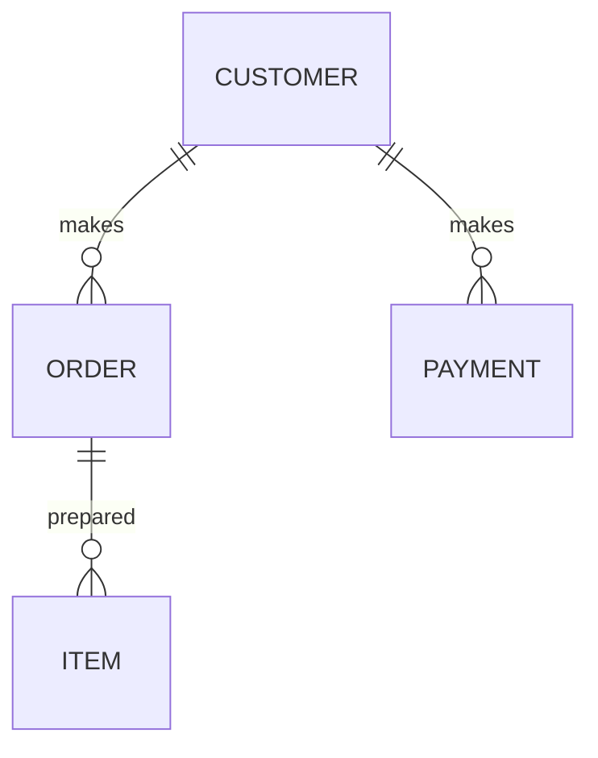

# 🧜‍♀️ mermaid-test
새롭게 지원되는 머메이드 플로우차트 테스트입니다. 

```mermaid 
graph TD
    A[하루 시작] -->|일어난다| B(세수한다)
    B --> C{오늘은 무엇을 할까}
    C -->|밥을 먹는다| D[냉장고 확인]
    C -->|다시 잔다| E[침대로 돌아가기]
    C -->|티비를 본다| F[거실로 가기]
``` 


## 플로우차트 테스트
### 라면끓이는 방법!  

```mermaid
	flowchart LR
	A{라면이 있는가?} -->|있다| B(냄비를 준비한다)
			B -->C(머그컵 2잔 분량의 물을 붓는다)
			C -->E(스토브를 키고 물을 끓인다)
			E -->F(적당히 끓으면 스프를 넣는다)
			F -->G(물이 완전히 끓으면 면과 파를 넣는다)
			G -->H((쫄깃한 면을 원하는가?))
	        	H -->|원한다| H1(면을 넣었다 뺐다를 반복한다)
	        	H -->|원치 않는다| H2(그냥둔다)
	        	H1 --> I(보기 좋게 그릇에 담는다)
	        	H2 --> I
	        	I --> J(맛있게 먹는다)
	   A -->|없다| K(라면을 사러간다)
	    		K --> L(원하는 라면을 고른다)
	    		L --> M(산다)
	    		M --> N(집에간다)
	    		N --> A
```

```mermaid
	sequenceDiagram
	    A->>+B: B야 소금좀 건내줘
	    B->>+A: 여기
	    A-->>-B: 고마워
```







```mermaid
		classDiagram
	    자바스크립트 타입 <|-- Apple
	    자바스크립트 타입 <|-- 5
	    자바스크립트 타입 <|-- True
	    자바스크립트 타입 : String 
	    자바스크립트 타입 : Number
	    자바스크립트 타입: Boolean
	    class Apple{
	      String
	    }
	    class 5{
	      Number
	    }
	    class True{
	      Boolean
	    }
```

```mermaid
		gantt
	    title 하루 일과
	    dateFormat  YYYY-MM-DD
	    section 오늘하루
	    세수하기   :a1, 10:00, 60min
	    밥먹기    :after a1  11:00, 30min
```

```mermaid
		gantt
	    title 하루 일과
	    dateFormat  HH-MM
	    axisFormat %H:%M
	    하루시작 : milestone, m1, 17:49,2min
	    할일1 : 60min
	    할일2 : 30min
```


