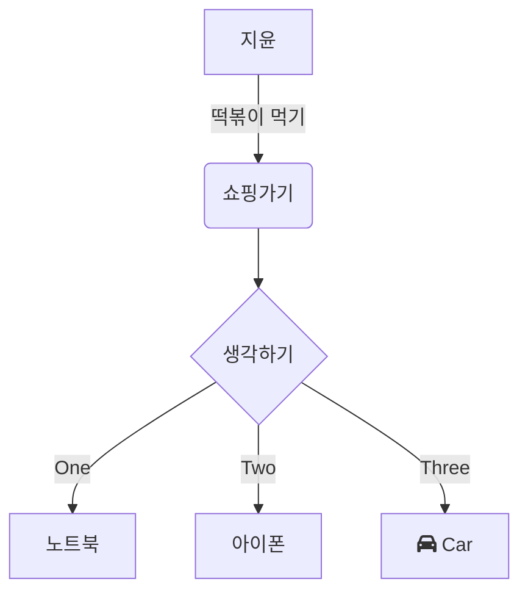
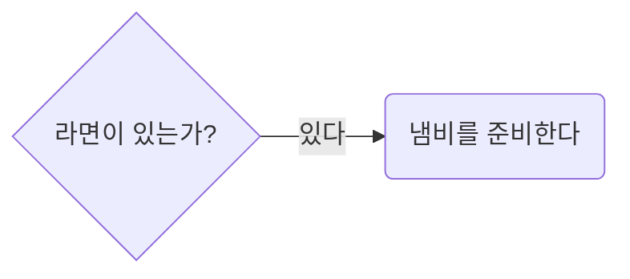

# 🧜‍♀️ mermaid-test
새롭게 지원되는 머메이드 플로우차트 테스트입니다. 

```mermaid 
flowchart TD
    A[지윤] -->|떡볶이 먹기| B(쇼핑가기)
    B --> C{생각하기}
    C -->|One| D[노트북]
    C -->|Two| E[아이폰]
    C -->|Three| F[fa:fa-car Car]
``` 
## 플로우차트 테스트
### 라면끓이는 방법!  

```mermaid
	flowchart LR
		A{라면이 있는가?} -->|있다| B(냄비를 준비한다) 
```
